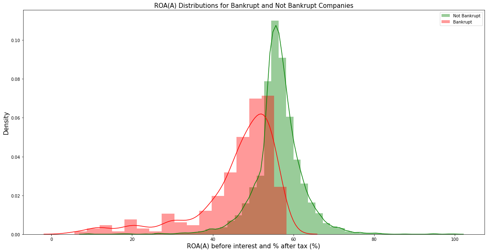
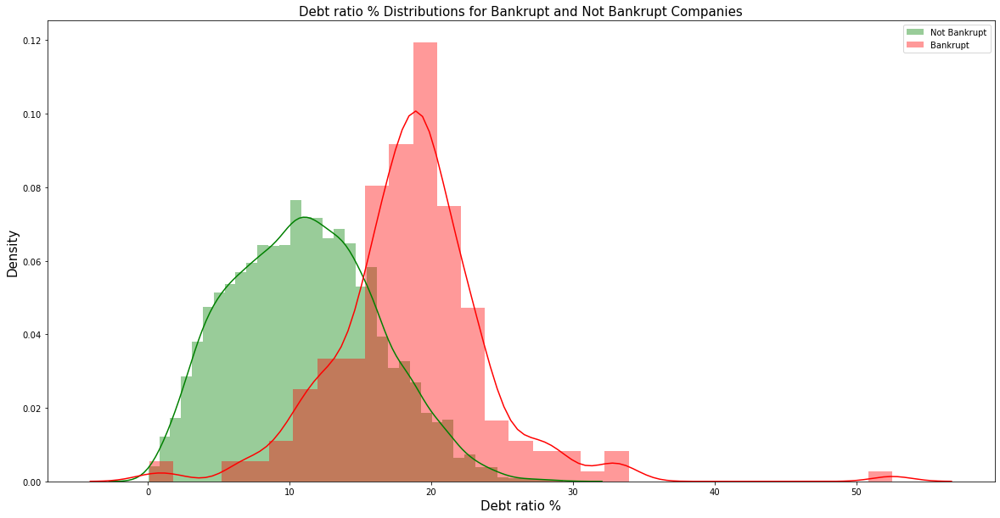
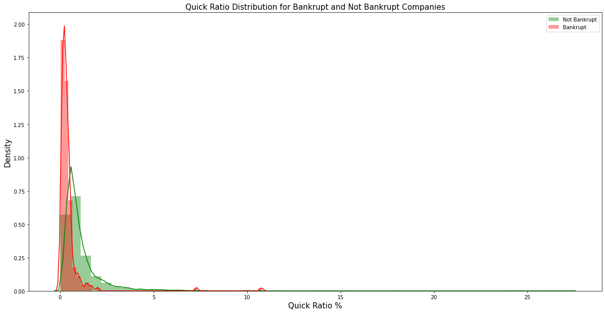
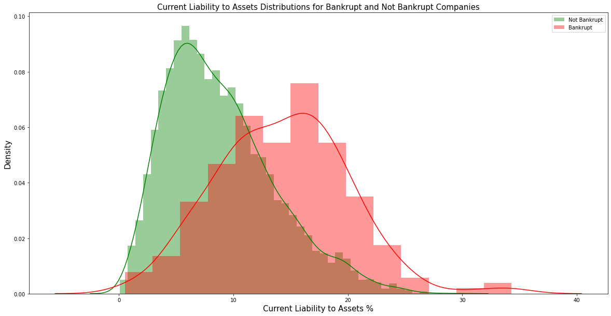
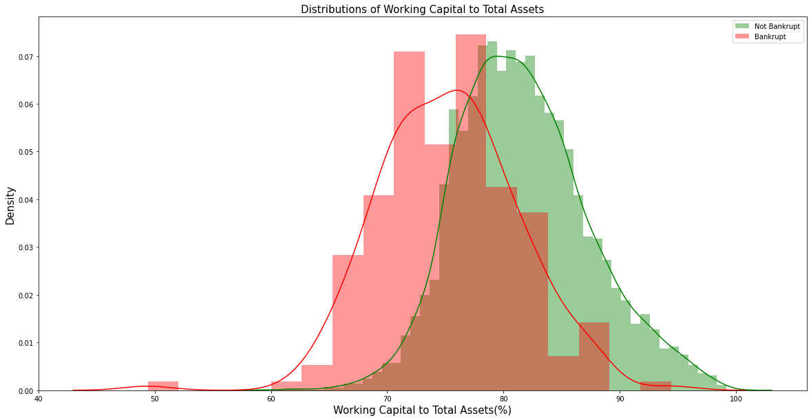
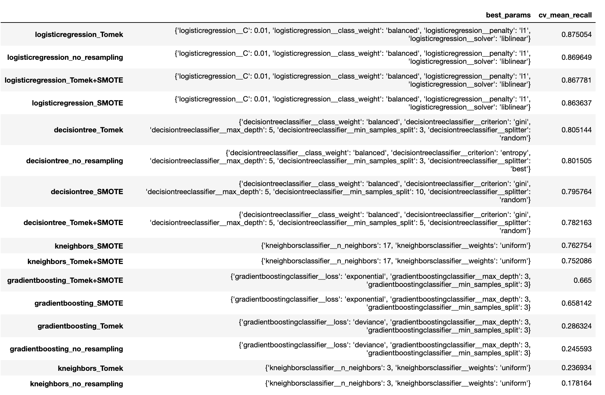
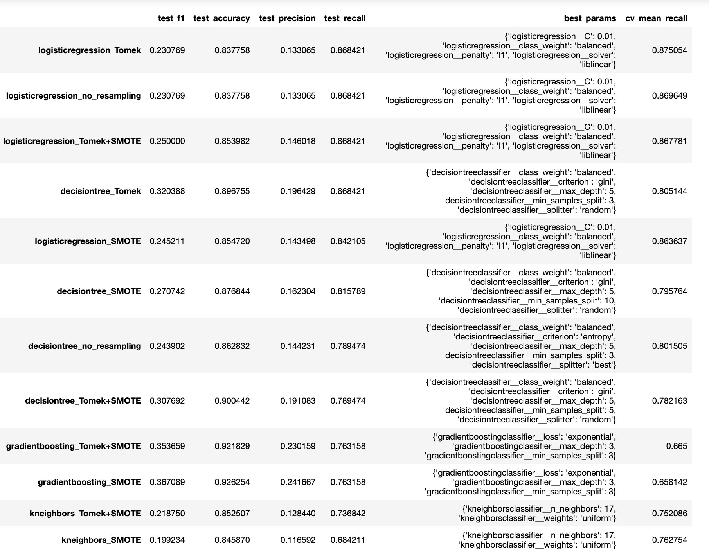

# Taiwan Bankruptcy Prediction
#### by Gary Schwaeber and Sunil Rao

## Overview - Business Problem
The business problem we are trying to solve is to help bank lenders by creating a predictive model for which companies will go bankrupt. The greatest risk and cost to the lender would be to lend to a company that eventually goes bankrupt and thus losing all principle and interest that company would owe. Therefore we will optimize our model and feature selection process to capture the best recall score. By optimizing for recall score we will be able to best predict the greatest proportion of companies that go bankrupt out of companies that actually went bankrupt.

## Data

The dataset, which was downloaded from Kaggle, contains financial ratios and a bankrupcty indicator for approximately 7000 Taiwanese companies. The data, which was originally gathered for a [research report](https://isslab.csie.ncu.edu.tw/download/publications/1.pdf) and was taken from the Taiwan Economic
Journal for the years 1999–2009. Per the report, Company bankruptcy was defined based on the business regulations of the Taiwan Stock Exchange. Company industries include manufacturing, shipping, tourism, retail, and others, but not financial.

We brought in 75 of the original 95 columns we deemed potentially significant. All original feature columns were numerical financial ratios with one binary categorical column (Liability-Assets Flag). Numerous variables had significant outliers which we primarily identified by looking where the max values were greater than 1. Here we found instances where there were groups of companies with ratios in millions or billions vs the majority of companies having ratios under 1. In some instance we binned or categorized those variables and in some instances we capped the variable.

There is a class imbalance in the data where approximately 97% of the companies did not go bankrupt and 3% did. To handle this imbalance in our modelling, we tested each model using SMOTE and/or Tomek Links.

## Exploratory Data Analysis

We found that ROA(A), Debt Ratio %, Net Income to Total Assets, Current Liability to Assets, Working Capital to Total Assets, and Long Term Liability to Current Assets were the ratios that had the strongest correlations and had the highest predictive value for determining bankrupty.

ROA(A) is Net income before interest and % after tax/Total Assets. ROA(A) is an indicator of how profitable a company is relative to its total assets. We can clearly see differences in the distributions for bankrupt companies who have lower and more left skewed ROA(A) relative to not bankrupt companies.


Debt Ratio % is Liability/Total Assets and measures the extent of a company’s leverage. Bankrupt companies tend to have higher and more right skewed debt ratios showing that they are typically more leveraged. 


Quick Ratio (aka Acid Test) is an indicator of a company’s short-term liquidity position and measures a company’s ability to meet its short-term obligations with its most liquid assets. We found that 75% of companies that went bankrupt had a Quick Ratio less than .5% while only 25% of companies that didn't go bankrupt had quick ratio that low. 


Current Liability to Assets is comparable to Debt Ratio % but measures shorter tem liabilities compared to all liabilities. The distribution in the distplot below again shows that bankrupt companies will typically have higher Current Liability to Assets relative to companies that didn't go bankrupt.


Working Capital to Total Assets compares liquid assets to total assets. We can see from the distributions that bankrupt companies have smaller ratios of liquid assets to total assets. This may indicate that in time of financial distress, these companies would have more difficult time offloading assets to satisfy their liabilities and avoid bankruptcy.



## Building Tuning and Testing Models

We tested our hypothesis on the following models: logistic regression, K nearest neighbors, decision trees, random forest, and gradient boosting to determine which algorithm performs best.

To handle the class imbalance we will test various models using SMOTE, Tomek Links, SMOTE and Tomek Links together, as well as no resampling. 

We utilized Scikit-learn pipelines so that the proper scaling and resampling of the data would occur in the cross validation phase. We used the Grid Search to iterate through different combinations of hyperparamters to determine which mix worked best with each algorithm.

## Model Cross Validation Training Scores

From the cross validation results, it appears Logistic Regression generally performs best, followed by decision trees, then K nearest neighbors. The different resampling methods also seem to have affected each of the models differently.


## Evaluate Best Models to Test Data 

The best performing model, optimizing for recall, was logistic regression fit using Tomek Links resampling with paramters C = 0.01, class_weight = 'balanced', penalty = 'l1', solver = 'liblinear'. We believe that given similar market conditions to the years covered in our dataset and access to similar data, we could deploy this model to unseen data and continue to predict roughly 87% of companies that go bankrupt out of the companies that actually did go bankrupt.


### Next Steps
In order to improve our modelling the below further steps can be taken
- Add more company financial data outside of the given financial ratios
- Add company industries and industry specific data
- Add local and global economic condition data for the time period
- Test with more classification machine learning algorithms and hyperparamters for tuning the models we used. With limited time and computing power we had to cut many hyperparameters to test in our grid search

## Repository Structure

```
├── code
│   ├── __init__.py
│   ├── modeling_functions.py
├── .gitignore
├── Readme.md
├── images
├── data
├── Taiwan_Bankruptcy_Prediction_Final.ipynb
└── final_results.pickle
```
